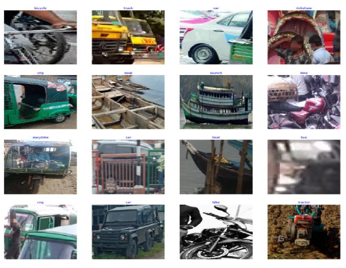
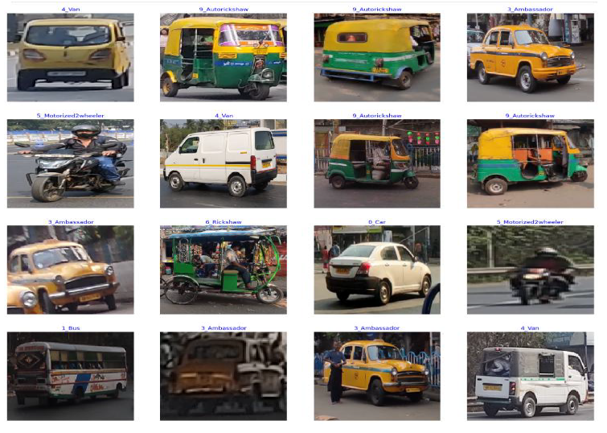
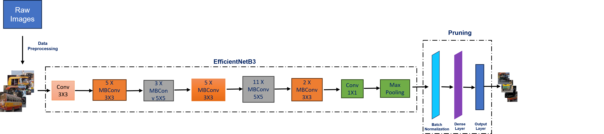
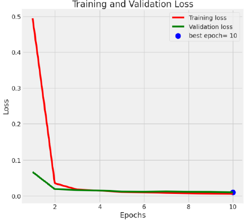
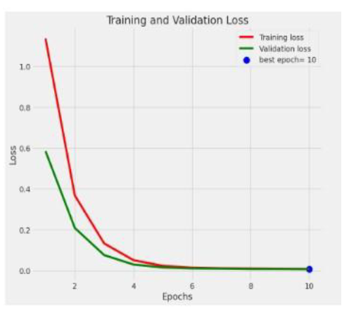
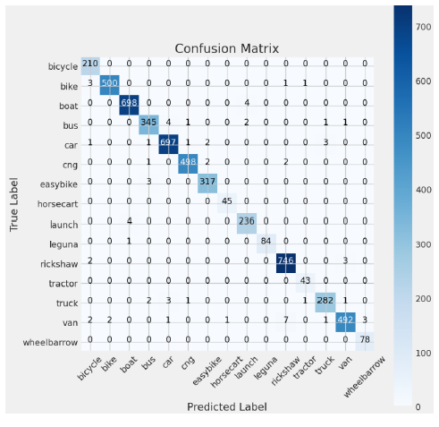
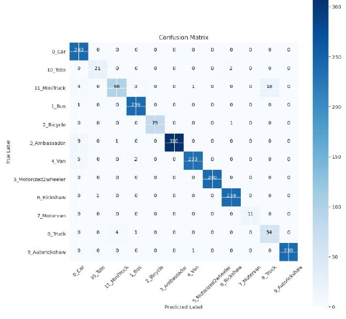

# Efficient Vehicle Classification Using a Streamlined Pruned Deep Learning Model  
**Accepted at RAIT 2025**

> **Authors:** Aritra Mondal, Utathya Aich, Pawan Kumar Singh  
> **Affiliation:** Department of Information Technology, Jadavpur University & CNH Industrial ITC  
> **Conference:** RAIT 2025, IEEE Indexed

---

## 📝 Abstract

Vehicle classification plays a critical role in surveillance, traffic monitoring, and intelligent transport systems. This work presents a two-stage deep learning framework based on **EfficientNetB3**, enhanced via **structured pruning** to balance accuracy and efficiency. Evaluated on **PoribohonBD** and **JUIVCDv1** datasets, our model achieved **98.70%** and **97.37%** accuracy respectively—outperforming prior state-of-the-art models. The pruning phase ensures deployment feasibility in resource-constrained environments.

---

## 📁 Dataset Samples

**PoribohonBD**  
- 9,058 images, 15 vehicle classes  
- Collected in Bangladesh using smartphones  
- Imbalanced: 'Horse-cart' least, 'Boat' most frequent



**JUIVCDv1**  
- 12 vehicle classes captured in Indian traffic  
- Includes occlusion, overlap, real-world lighting



---

## 📐 Proposed Framework

Our proposed two-phase deep learning framework is designed to maximize classification accuracy while minimizing computational overhead—ideal for real-world deployment in constrained environments.



### 🔁 Step-by-Step Architecture

**1. Data Preprocessing**  
- Annotated bounding boxes are used to crop vehicle regions from raw images.  
- This isolates relevant features, reducing background noise and improving model focus.

**2. Feature Extraction with EfficientNetB3**  
- EfficientNetB3 pre-trained on ImageNet is used for vehicle classification.  
- Leverages compound scaling to optimize depth, width, and resolution.

**3. Dense Layer Optimization**  
- Includes: ReLU activations, L1 & L2 regularization, Batch Normalization, Dropout (15–25%)

**4. Pruning Strategy**  
- Magnitude-based structured pruning applied to dense layers.  
- Sparsity increased from 30% to 80% over 2000 steps using TensorFlow PolynomialDecay.

**5. Fine-Tuning & Evaluation**  
- Model retrained with optimal weights.  
- Final metrics include accuracy and confusion matrix visualisations.

---

## 📊 Results

| Dataset       | Accuracy (Before) | Accuracy (After Pruning) |
|---------------|------------------|---------------------------|
| PoribohonBD   | 96.62%           | ✅ **98.70%**             |
| JUIVCDv1      | 97.12%           | ✅ **97.37%**             |

**Loss Curves:**

  


**Confusion Matrices:**

  


---

## 📚 Citation [To be updated later]

If you use this work, please cite:

```bibtex
@inproceedings{mondal2025efficient,
  title={Efficient Vehicle Classification Using a Streamlined Pruned Deep Learning Model},
  author={Mondal, Aritra and Aich, Utathya and Singh, Pawan Kumar},
  booktitle={Proceedings of the IEEE RAIT 2025},
  year={2025}
}
